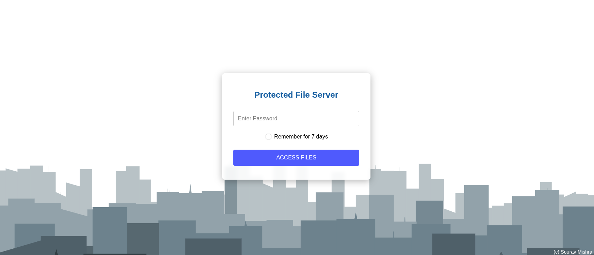

# File Server with password-protected landing page

A lightweight directory indexing and password protection tool for static file servers. 

This script generates index.html files for all directories and subdirectories, with password protection 
for the top-level directory.



## Features

- Recursively generates index.html files for any directory structure
- Password protects the main index.html while keeping subdirectories accessible
- Mobile-friendly, responsive design
- "Remember me" functionality for 7 days
- Works on any static hosting platform (Google Cloud Storage, S3, GitHub Pages, etc.)
- No server-side dependencies - pure HTML, CSS, and JavaScript
- Optional file filtering to include only specific file types

## Installation

```bash
# Clone the repository
git clone https://github.com/gradientwolf/pycloudvault.git
cd pycloudvault

# Install dependencies
pip install pycryptodome
```

## Usage

```bash
python encrypt_indexpage.py /path/to/directory --password YOUR_PASSWORD
```

### Options

```
--password, -p  Password for accessing the top-level directory (required)
--filter,   -f  Include only files matching pattern (e.g., "*.jpg")
--verbose,  -v  Go verbose in output
--dryrun,   -d  Test without writing changes
--footer,   -b  Custom footer text (banner)
```

### Example

```bash
# Create index files for your Documents folder with password protection
python encrypt_indexpage.py ~/Documents --password mysecret --verbose

# Only include PDF files in the listings
python encrypt_indexpage.py ~/Documents --password mysecret --filter "*.pdf"

# Add custom footer
python encrypt_indexpage.py ~/Documents --password mysecret --footer "© 2025 My Company"
```

## Hosting on Google Cloud Storage

### Quick Deployment

If using GCP, you could use the included `landingpage_upload.sh` script for a one-command process:

```bash
# Make the script executable
chmod +x landingpage_upload.sh

# Run the script with your password
./landingpage_upload.sh mysecret
```

The script does this:

1. Removes any existing index.html files
2. Generates new index files with password protection
3. Syncs everything to your Google Cloud Storage bucket


### Manual Deployment

1. Generate your index files:
   ```bash
   python encrypt_indexpage.py ./my_files --password mysecret
   ```

2. Upload to your GCS bucket:
   ```bash
   gsutil -m rsync -r -d . gs://your-bucket-name/
   ```

3. Set bucket permissions and enable website hosting in the Google Cloud Console.

4. Access your file server at the GCS website URL.

## How It Works

- The script traverses your directory structure and creates index.html files in each folder
- The top-level index.html contains a password protection mechanism
- Subdirectory navigation links point to each folder's index.html file
- Password verification happens entirely client-side using JavaScript
- Login status is remembered using browser local storage

## Security Note

This tool uses simple client-side protection and is suitable for casual use or internal sharing. It is not intended for highly sensitive data, as the content is only base64-encoded, not encrypted with strong cryptography.

## License

MIT
